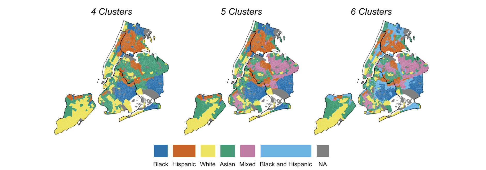

# Sequence Analysis of Neighborhood Racial and Ethnic Changes: The Case of New York City 1980-2020

This paper demonstrates the application of sequence analysis to develop a typology of racial and ethnic trajectories in New York City neighborhoods from 1980 to 2020 using a reproducible R workflow. Our workflow begins with using an unsupervised classification method, k-means, at each decennial cross-section to derive 6 classes describing the racial and ethnic makeup of neighborhoods during the study period. These classes include four that depict a majority of Black, White, Hispanic, and Asian residents, and two mixed-race classes, Black and Hispanic, and a White majority with a mixture of other races. We then develop a sequence of classes for each census tract over the 5 decennial time stamps. Finally, we derive a longitudinal typology describing the predominant pathways of change using sequence analysis. This resulted in 14 distinct pathways including transitions to Hispanic and Asian majorities emerging from historically White or Black neighborhoods. The findings underscore the gradual nature of neighborhood racial transformations. Our approach is reproducible for researchers wanting to explore and visualize multidimensional neighborhood dynamics.

[Link to R workflow](https://ericdelmelle.github.io/sequencePaper/) 
[Link to repository](https://github.com/ericdelmelle/sequencePaper/) 

